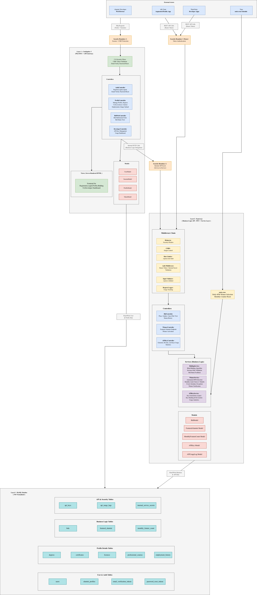

# Alumni Influencers - Web API Development Platform
## 6COSC022W Advanced Server-Side Web Development - Coursework 1

### Table of Contents

1. [Project Overview] (#project-overview)
2. [System Architecture] (#system-architecture)
3. [Technology Stack] (#technology-stack)
4. [Prerequisites] (#prerequisites)
5. [Installation and Setup] (#installation-and-setup)
6. [Environment Variables] (#environment-variables)
7. [Database Schema] (#database-schema)
8. [Application Structure] (#application-structure)
9. [Features] (#features)
10. [API Documentation] (#api-documentation)
11. [Security Implementation] (#security-implementation)
12. [Bidding System] (#bidding-system)
13. [Sponsorship Model] (#sponsorship-model)
14. [Scheduled Tasks] (#scheduled-tasks)
15. [Testing] (#testing)
16. [Troubleshooting] (#troubleshooting)

---

## Project Overview

Alumni Influencers is a web-based platform commissioned by the University of Eastminster, developed by Phantasmagoria Ltd. The platform transforms alumni engagement into a self-sustaining marketplace where successful alumni leverage their professional credentials to compete for daily featured slots through a blind bidding system sponsored by professional course providers, licensing bodies, and certification organisations.
The platform serves two primary audiences. Alumni interact through a server-rendered web application to manage their profiles, receive sponsorship offers, and participate in daily bidding. External clients, including an augmented reality application and third-party developer applications, consume alumni data through a RESTful API secured with bearer token authentication.

---

## System Architecture
The platform adopts a three-layer MVC architecture built around the API Gateway Pattern. And Architecture Diagram is shown below:



### Layer 1 - CodeIgniter 4 (Web MVC and API Gateway)

CodeIgniter 4 serves as the web-facing application layer and functions simultaneuosly as an internal API Gateway. It handles all server-rendered web functionality, including alumni registration, authentication 
with session management, profile creation, and editing through a structured web forms, bidding submission interface, and the developer API key management dashboard. CodeIgniter does not contain core business logic. When a web user performs an action requiring
business processing, the CodeIgniter controller delegates that request to Express.js via an internal HTTP call. This ensures all business rules reside in a single authoritative location.

### Layer 2 -  Express.js (Business Logic API with MVC and Service Layer)

Express.js operates as the core business logic engine and the public-facing developer API. It is structured using the MVC pattern with an additional service layer for complex business operations. It handles blind bidding logic, automated winner selection via node-cron, monthly appearance limit enforcement, sponsorship management, bearer token authentication for external clients, API key lifecycle management, usage logging, and comprehensive Swagger/OpenAPI documentation served at the /api-docs endpoint.

### Layer 3 – MySQL Database (3NF Normalized)
Both services connect to a shared MySQL relational database designed in Third Normal Form. The schema is logically partitioned by ownership. CodeIgniter primarily reads and writes user accounts, sessions, and profile data. Express.js owns business-critical tables including bids, featured alumni records, sponsorship offers, API keys, and usage logs. Database-level constraints including foreign keys, unique indexes, and check constraints provide an additional layer of data integrity enforcement independent of application-level validation.

### Security Boundaries

The architecture establishes three distinct security boundaries. Security Boundary 1 protects web users through session-based authentication with CSRF Token protection via CodeIgniter. Security Boundary 2 governs internal service-to-service communication between CodeIgniter and Express.js using a shared internal API secret. Security Boundary 3 secures external API access through bearer token authentication managed by Express.js.

---

## Technology Stack

### Backend - Web Application Layer
- CodeIgniter 4 (PHP 8.1+)
- Boostrap Admin Template (server rendered views)
- CodeIgniter Session Library
- CodeIgniter Security Library

### Backend - Business Logic Layer
- Express.js (Node.js 18+)
- express-validator (input validation)
- express-rate-limit (rate limiting)
- helmet (security headers)
- cors (cross-origin resource sharing)
- bcryptjs (password hashing)
- crypto (token generation)
- node-cron (scheduled tasks)
- swagger-jsdoc and swagger-ui-express (API documentation)
- mysql2 (database connection)
- dotenv (environment configuration)

### Database
- MySQL

### Development Tools
- Nodemon (Express.js hot reload)
- Postman (API Testing)

---

## Prerequisites

Before setting up the project, ensure the following software is installed on your machine:

- PHP 8.1 or higher with the following extensions enabled: intl, mbstring, json, mysqlnd, curl
- Composer
- Node.js 18 or higher
- npm (Node Package Manager)
- MySQL 8.0 or higher
- Git

---

## Installation and Setup

### Step 1 – Clone the Repository

```
git clone https://github.com/Nipun23a/Advanced-Server-Side-Coursework-1.git
cd Advanced-Server-Side-Coursework-1
```

### Step 2 – Database Setup
Log into MYSQL and create the database.
```
mysql -u root -p
CREATE DATABASE alumni_influencers;
EXIT;
```

### Step 3 - CodeIgniter 4 Setup
```
cd codeigniter-app
composer install
cp env .env
```

Edit the .enf file with your database credentials and application settings.
(see Environment Variables section below)

Run database migrations to create all tables.
```
php spark migrate
```

Start the CodeIgniter development server.
```
php spark serve --port 8080
```

The web application will be available at http://localhost:8080/.

### Step 4 - Express.js Setup
Open a new terminal window.
```
cd express-api
npm install
cp .env.example .env
```
Edit the .env file with your database credentials and configuration (see Environment Variable section below).

Start the Express.js API Server.
```aiignore
npm run dev
```

The API server will be available at http://localhost:3000.
Swagger documentation will be accessible at http://localhost:3000/api-docs.

---

## Environment Variables

### CodeIgniter 4 (.env)
```
# Application
CI_ENVIRONMENT = development
app.baseURL = 'http://localhost:8080'

# Database
database.default.hostname = localhost
database.default.database = alumni_influencers
database.default.username = root
database.default.password = YOUR_DB_PASSWORD
database.default.DBDriver = MySQLi
database.default.port = 3306

# Session
session.driver = 'CodeIgniter\Session\Handlers\DatabaseHandler'
session.cookieName = 'alumni_session'
session.expiration = 7200
session.savePath = 'ci_sessions'
session.matchIP = false
session.timeToUpdate = 300

# Security
security.csrfProtection = 'session'
security.tokenRandomize = true
security.regenerate = true

# Internal API Communication
INTERNAL_API_URL = http://localhost:3000
INTERNAL_API_SECRET = YOUR_INTERNAL_API_SECRET_KEY

# Email Configuration
email.protocol = smtp
email.SMTPHost = YOUR_SMTP_HOST
email.SMTPPort = 587
email.SMTPUser = YOUR_EMAIL_ADDRESS
email.SMTPPass = YOUR_EMAIL_PASSWORD
email.mailType = html
email.fromEmail = noreply@eastminster.ac.uk
email.fromName = Alumni Influencers Platform

# File Upload
upload.maxSize = 2048
upload.allowedTypes = jpg,jpeg,png,gif
upload.uploadPath = ./public/uploads/profiles/
```

### Express.js (.env.example)
```aiignore
# Server
PORT=3000
NODE_ENV=development

# Database
DB_HOST=localhost
DB_PORT=3306
DB_NAME=alumni_influencers
DB_USER=root
DB_PASSWORD=YOUR_DB_PASSWORD

# Authentication
JWT_SECRET=YOUR_JWT_SECRET_KEY
JWT_EXPIRY=24h

# Internal Service Communication
INTERNAL_API_SECRET=YOUR_INTERNAL_API_SECRET_KEY

# API Key Configuration
API_KEY_LENGTH=64
API_KEY_PREFIX=alum_

# Rate Limiting
RATE_LIMIT_WINDOW_MS=900000
RATE_LIMIT_MAX_REQUESTS=100
RATE_LIMIT_BID_WINDOW_MS=60000
RATE_LIMIT_BID_MAX_REQUESTS=10

# Bidding Configuration
BID_CUTOFF_HOUR=18
BID_CUTOFF_MINUTE=0
BID_TIMEZONE=Europe/London
MONTHLY_FEATURE_LIMIT=3
MONTHLY_FEATURE_LIMIT_WITH_EVENT=4

# Email Notifications
SMTP_HOST=YOUR_SMTP_HOST
SMTP_PORT=587
SMTP_USER=YOUR_EMAIL_ADDRESS
SMTP_PASS=YOUR_EMAIL_PASSWORD
NOTIFICATION_FROM_EMAIL=noreply@eastminster.ac.uk

# CORS
CORS_ORIGIN=http://localhost:8080
CORS_METHODS=GET,POST,PUT,DELETE
CORS_CREDENTIALS=true

# Logging
LOG_LEVEL=debug
LOG_FILE=./logs/api.log
```
--- 

## Database Schema
The database consists of 17 tables organized into four logical groups. All tables follow Third Normal Form normalisation to eliminate data redundancy and ensure referential integrity. The ER diagram below shows the database schema:


### User and Authentication Tables

**users** – Stores alumni, developer, and admin accounts with hashed passwords and email verification status. The role field uses an ENUM to distinguish between account types. The email field has a unique constraint to prevent duplicate registrations.

**alumni_profiles** – Stores profile information for each alumni with a one-to-one relationship to the users table. Contains biography, LinkedIn URL, and profile image path. The user_id field has a unique constraint ensuring one profile per user.

**email_verification_tokens** – Stores hashed verification tokens with expiry timestamps. The used_at field is null until the token is consumed, enforcing single-use behaviour. Multiple tokens may exist per user to handle re-sends.

**password_reset_tokens** – Stores hashed password reset tokens with expiry timestamps. Follows the same single-use pattern as email verification tokens with a shorter expiry window.

### Profile Detail Tables
**degrees** – Stores academic degrees with institution URLs and completion dates. Each degree is linked to an alumni profile via profile_id with a many-to-one relationship.

**certificates** – Stores professional certifications with provider URLs and completion dates. Each certificate is linked to an alumni profile via profile_id with a many-to-one relationship.

**licences** – Stores professional licences with provider URLs, completion dates, and optional expiry dates. Each licence is linked to an alumni profile via profile_id with a many-to-one relationship.

**professional_courses** – Stores short professional courses with provider URLs, completion dates, and optional end dates. Each course is linked to an alumni profile via profile_id with a many-to-one relationship.

**employment_history** – Stores employment records with company names, roles, start dates, and optional end dates where null indicates current employment. Each record is linked to an alumni profile via profile_id with a many-to-one relationship.

### Business Logic Tables
**sponsors** – Stores sponsoring organisations including professional course providers, licensing bodies, and certification organisations. The sponsor_type field uses an ENUM to categorise the sponsor.

**sponsorship_offers** – Stores individual sponsorship offers linking a sponsor to a specific alumni and their credential (certificate, licence, or professional course). Uses a polymorphic relationship via sponsorable_id and sponsorable_type fields. The offer_amount records the monetary value offered. The status field tracks the offer lifecycle from pending through accepted or declined to paid. The is_paid field is only set to true when the alumni wins the daily bid and their profile is displayed.

**bids** – Stores daily bid submissions. The bid_amount field records the amount the alumni chooses to bid from their available sponsorship funds. The bid_status ENUM tracks whether the bid is active, won, or lost. The is_cancelled boolean allows bid cancellation. The bid_date field indicates which day the alumni is bidding for. A unique composite constraint on user_id and bid_date ensures one bid per user per day. The sponsorship_total field records the total sponsorship money available at the time of bidding for audit purposes.

**featured_alumni** – Stores the daily winner record linking the winning user and their bid to a specific featured date. A unique constraint on featured_date ensures only one alumni is featured per day. A unique constraint on bid_id ensures each bid can only win once.

**monthly_feature_count** – Tracks how many times each alumni has been featured in a given month. A unique composite constraint on user_id, year, and month ensures one tracking record per user per month. The attended_event boolean determines whether the alumni qualifies for a fourth appearance that month.

### API and Security Tables

**api_keys** – Stores hashed API keys for developer and external client authentication. The raw key is displayed only once at creation. The is_active field allows soft deactivation and the revoked_at timestamp records when a key was revoked.

**api_usage_logs** – Stores every API request for usage analytics. Records the associated api_key_id, endpoint accessed, HTTP method, timestamp, and source IP address. This table supports the usage statistics requirement.

**internal_service_secrets** – Stores hashed secrets used for internal communication between CodeIgniter and Express.js. The is_active field allows secret rotation without downtime.

---

## Application Structure

### CodeIgniter 4 Directory Structure

```aiignore
This need to added
```
### Express.js Directory Structure
 ```
 This need to added
 ```

## Features
### Alumni Registration and Authentication

The registration system requires a valid university domain email address. During registration the system validates email format and domain, enforces password strength requirements (minimum 8 characters, uppercase, lowercase, number, special character), checks for duplicate email addresses, and hashes the password using bcrypt with 12 salt rounds before storage.

Upon successful registration an email verification token is generated using crypto.randomBytes, hashed with SHA-256, and stored with a 24-hour expiry. The raw token is sent to the user via email as a verification link. Login is blocked until the email is verified.

Login authenticates the user against the stored bcrypt hash, creates a server-side session via CodeIgniter's session library, and sets secure cookie attributes including HttpOnly, Secure, and SameSite flags. Sessions expire after 2 hours of inactivity with automatic cleanup.

Logout destroys the server-side session and clears the session cookie.

Password reset generates a time-limited token (1 hour expiry), sends it via email, and allows the user to set a new password. The token is single-use and marked as consumed after successful reset.

### Compete Alumni Profile Management


Alumni can manage their complete professional profile through server-rendered web forms. Each profile section supports full CRUD operations (create, read, update, delete).

Personal information includes biography text and LinkedIn profile URL with URL format validation.

Degrees section allows adding multiple academic degrees with degree name, institution URL (validated), and completion date.

Certificates section allows adding multiple professional certifications with certificate name, provider URL (validated), and completion date.

Licences section allows adding multiple professional licences with licence name, provider URL (validated), completion date, and optional expiry date.

Professional courses section allows adding multiple short courses with course name, provider URL (validated), completion date, and optional end date.

Employment history section allows adding multiple employment records with company name, role/title, start date, and optional end date where null indicates current employment.

Profile image upload accepts JPG, JPEG, PNG, and GIF formats with a maximum file size of 2MB. Images are stored on the server filesystem with the path recorded in the database.

The profile dashboard displays a completion status indicator showing which sections have been filled out.

### Blind Bidding System

The bidding system allows alumni to compete for the daily "Alumni of the Day" featured slot using sponsorship funds. The system operates as a blind auction where bidders cannot see the current highest bid.

Alumni can place a single bid per day for the following day's featured slot. The bid amount must not exceed their total available sponsorship funds from accepted offers. Once placed, bids can only be increased (not decreased) and can be cancelled entirely.

Bid status feedback tells the alumni whether they are currently winning or not winning without revealing the actual highest bid amount. This feedback updates when other bids are placed or modified.

At 6 PM London time each day, the automated winner selection process runs via node-cron. It identifies the highest non-cancelled active bid, marks it as won, marks all other bids for that date as lost, creates a featured alumni record for the following day, increments the winner's monthly feature count, updates sponsorship offer payment status for the winner, and sends email notifications to the winner and losing bidders.

### Monthly Limit Enforcement

Each alumni can be featured a maximum of 3 times per calendar month. If an alumni has attended a university alumni event (recorded via the attended_event flag), they are permitted a 4th appearance that month. The system checks this limit before allowing bid placement and prevents bidding when the limit is reached. Monthly counters reset at the beginning of each calendar month.

### Sponsorship Model

Sponsors (professional course providers, licensing bodies, and certification organisations) offer monetary sponsorship to alumni to promote their credentials on the platform. Each sponsorship offer is linked to a specific credential (certificate, licence, or professional course) owned by the alumni.

Alumni can view, accept, or decline sponsorship offers. Accepted offers contribute to the alumni's available bidding funds. Sponsors are only charged (is_paid set to true) when the alumni wins the daily bid and their profile is displayed, ensuring a performance-based sponsorship model.

The total available sponsorship funds for an alumni is calculated as the sum of all accepted and unpaid sponsorship offer amounts.

### Developer API Key Management

Users with the developer role can generate API keys for external application access. The raw API key is displayed only once at the time of creation. The key is hashed using SHA-256 before storage, meaning the raw key cannot be recovered from the database.

Developers can view a list of their API keys showing creation date, active status, and last used timestamp. Keys can be revoked at any time, which sets is_active to false and records the revocation timestamp. Revoked keys immediately cease to authenticate.

The usage statistics dashboard shows the number of API requests per key, endpoint access frequency, timestamps of access, and source IP addresses.

### Public Developer API

The public API provides a single primary endpoint for retrieving today's featured alumni profile. This endpoint is consumed by the augmented reality client and third-party developer applications.

All API endpoints are documented with Swagger/OpenAPI 3.0 and served via an interactive UI at the /api-docs path. Documentation includes request and response schemas, authentication requirements, error response formats, and example payloads.
 
---

## Api Documentation

### Authentication

```aiignore
This need to Implemented
```

### Public Endpoints

```aiignore
This need to Implemented
```

### Bidding Endpoints (Internal Access)
```
    This need to Implemented 
```

### Sponsorship Endpoints (Internal Access)
```aiignore
This need to Implemented
```

### API Key Managment Endpoints (Internal Access)
```aiignore
This need to Implemented
```

### Winner Endpoints (Internal Access)
```aiignore
This need to Implemented
```

### Response Format
```aiignore
This need to Implemented
```


